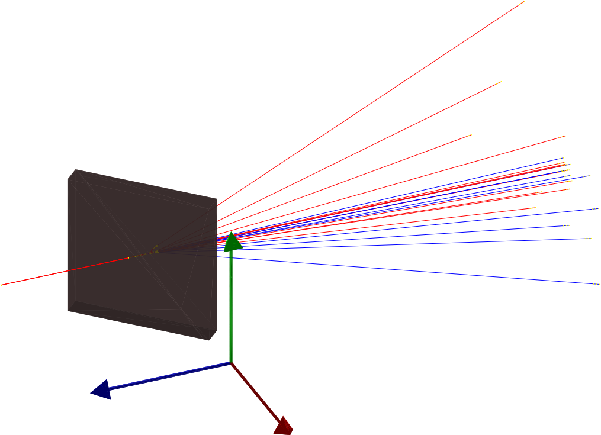

# GRAPPA (Geant4 RApid Pair Production Application)



---
# Overview
GRAPPA is a Geant4 application that simulates theinteraction of an incoming particle beam
(typically electron or photons) with an High-Z materialfoil.
The basic GRAPPA geometry consists of an incoming beamand a square target of given thickness (foil) that canbe rotated around the vertical axis.
Detectors are placed onto the _world_ boundary, and the_world_ is a sphere that surrounds the initial particlesand the target.
Final positions, momenta and proper time are registeredby the detectors, that are triggered by the passage of

- Primary particles
- Electrons
- Positrons
- Pions
- Muons
- Photons

At the end of a simulation, GRAPPA produces
an histogram plot file, where many of the producedparticle statistics are analyzed,
an histogram ROOT file and a _Ntuple_ ROOT file.
In Geant4, an Ntuple represents a file where each column stores some particular data (for example x coordinate or y momentum) of a given particle.

# Build

GRAPPA is a Geant4 (G4) application, therefore it requires that G4 is previously installed on the system.
A comprehensive guide on how to install G4 can be found on the [G4 installation guide](https://geant4-userdoc.web.cern.ch/UsersGuides/InstallationGuide/html/index.html).

## Requirements

GRAPPA requires:
- `Geant4` installed on the system
- `C++` compiler (standard required C++-17)

Besides, other optional argument will enable extra features:
- Mutithreading support: G4 built with `-DGEANT4_BUILD_MULTITHREADED:BOOL=ON`.
If G4 is built with multithreading support, GRAPPA will automatically execute using multiple threads, unless specified differently in the simulation input.
- Visualization support: In order to produce visual outputs,
you must install some of the G4 provided visualization drivers (_e.g._ OpenGL, RayTracer, QT5, etc...),
that in turn require the correct visualization drivers to be installed on the system.
Please refer to the installation guide for more information.
- For nicer histogram plots, `Freetype` libraries should be available.
G4 must be built with `-DGEANT4_USE_FREETYPE:BOOL=ON` for `Freetype` support in GRAPPA.
- For the analysis of the `ROOT` (default) output file, `ROOT` should be installed on the system ([ROOT](https://root.cern)).

All of the mentioned additional features do not require
any compilation flag to be specified in the building process.
In fact, they are automatically detected in the G4 installation.

## Build instructions

GRAPPA is best built using cmake. From the source folder you can build and install GRAPPA using the commands

```
cmake . -B build -DCMAKE_INSTALL_PREFIX=. -DGeant4_DIR={G4 cmake directory on the system}
cmake --build . --config Release --target install
```

You should provide `cmake` with the G4 installation directory containing the `Geant4Config.cmake` file.
Typically, it can be found in
`${G4_base_install_dir}/lib/Geant4-version`.
Depending on the system, one may want to change the `CMAKE_INSTALL_PREFIX` to a conventient location. If the flag is passed as specified in the example, GRAPPA is installed in the `bin` directory of the source code folder.

---

# Run a simulation and postprocess data

GRAPPA can either run using an interactive user interface (`UI`) or using a provided macro script.
Before running, the G4 initialization script, provided by G4, must be sourced.
It is located in the bin directory of the G4 installation directory and it should be sourced with

```
source ${G4_base_install_dir}/bin/geant4.sh
```

## GRAPPA in interactive mode

Launch GRAPPA with no extra argument using
```
./GRAPPA
```
and you will be prompted to the interactive session.
From there, you can control the simulation via the G4 `UI` commands.
> GRAPPA can only be run in interactive mode if some visualization driver is provided.

## Execute macro

In order to execute a macro, you should provide it when running the program as
```
./GRAPPA /path/to/macro
```
Examples of macros can be found in the `script/run` folder.

## Structure of macro files

Macro files in GRAPPA act as input files, providing commands to initialize
simulations, change parameters, set up the in-situ data analysis, change the physics, _etc..._

GRAPPA accepts all the basic Geant4 commands and introduces some specific ones.
In this guide we only discuss some simple use cases, for a more complete manual please refer to the 
[G4 application developers guide](https://geant4-userdoc.web.cern.ch/UsersGuides/ForApplicationDeveloper/html/index.html).

In a typical macro file, one wants to address some aspects of the simulation:

- Define the initial particle source
- Assemble the target geometry
- Modify the physics package
- Personalize the data analysis
- Set up the visualization
- Start the Run
- Others

Macro files are saved using the `.mac` extension and interpret
everything after a `#` as comments.

### Define the initial particle source

GRAPPA can shoot particle either from a [General Particle Source](https://geant4-userdoc.web.cern.ch/UsersGuides/ForApplicationDeveloper/html/GettingStarted/generalParticleSource.html?highlight=gps) (that is the default behavior),
where the beam source statistics must be specified,
or from a file of pre-generated list of positions and momenta.
Choice between GPS and particles from file must be made before the run initialization.
An example of GPS settings is
```
# =/=/=/=/= Particle source section =/=/=/=/=

# Set the particle source: must be done after run initialization.
# Particle type can be chosen between e- and gamma (for our use)

/gps/verbose 0 # verbose level of the GPS
/gps/particle e- #electron chosen as source

# Particle source spatial information

/gps/pos/type Beam # This is the source type, it represents a beam in the focal position
/gps/pos/centre 0 0 5 mm
/gps/pos/shape Circle
# The radius parameter defines a central flat plateau
/gps/pos/radius 0 mm
# The sigma_r parameter adds a gaussian uncertainty around the center
/gps/pos/sigma_r 10 um

# Angular distribution of the beam
/gps/ang/type beam1d  
/gps/ang/sigma_r 0.002 rad # Beam divergence

# Energy distribution of the beam
/gps/ene/mono 10 GeV # Central beam energy
/gps/ene/type Gauss
/gps/ene/sigma 10 MeV # Beam energy spread
```

In case you want to use a particle source extracted from a file,
you should provide an ASCII file with the phase space coordinates of the particles.
The command to extract particles from a given ASCII file is

```
# Run these commands before initializing the run
/particle_source/ParticlesFromFile true
/particle_source/FileName Filename.txt

# ... (Other operations)
# Run initialization
/run/initialize
# ... (Other operations)

# Define particle type (default is electrons)
/gun/particle gamma
```
The structure of an ascii file is a six-column list of all the particles, in the form:

| x [mm] | y [mm] | z [mm] | px [MeV] | py [MeV] | pz [MeV] |

(separated by spaces or tabs).

### Modify the target geometry

Commands to modify the geometry are introduced specifically for GRAPPA
and, as such, you will not find them in the G4 official guide.

They **must** be invoked before the run is initialized in order to avoid the loss of the geometry.
```
# Modify geometry (custom functions)

# Modify the world radius
/geometry/world/radius 120 cm
# Square target side length
/geometry/target/size 10 mm
# Where the center of the target is placed
/geometry/target/center 0 0 0 mm
# Target thickness
/geometry/target/thickness 3 mm
# Target rotation around the y axis
/geometry/target/rotation 45 deg
# Target material
/geometry/target/material G4_W
```

The _world_ is a sphere that surrounds everything else,
so please ensure that its radius is large enough.
Sensitive detectors are positioned on the world boundary (_i.e._ they are spherical),
such that when a particle reaches them, it is registered before being killed.

### Analysis

Analysis commands allow to personalize both the _in-situ_ histograms that GRAPPA generates at the end of the simulation and the output files for the raw data.

The complete list of generated histogram is the following:

```

# Histogram list
# 1D
# - 0 Final Energy of primaries
# - 1 Final Energy of positrons
# - 2 Final Energy of electrons
# - 3 Final Energy of photons
# - 4 Final Energy of pions
# - 5 Final Energy of muons
# - 6 Initial Energy of primaries
# - 7 Final theta of primaries
# - 8 Final theta of electrons
# - 9 Final theta of positrons
# - 10 Final theta of photons
# - 11 Final theta of pions
# - 12 Final theta of muons
# - 13 Positron Energy if theta < 1 mrad
# - 14 Positron Energy if theta < 5 mrad
# - 15 Positron Energy if theta < 10 mrad
# - 16 Positron Energy if theta < 20 mrad
# - 17 Positron Energy if theta < 50 mrad
# - 18 Final phi of primaries
# - 19 Final phi of electrons
# - 20 Final phi of positrons
# - 21 Final phi of photons
# - 22 Final phi of pions
# - 23 Final phi of muons
#
# 2D
# - 0 Initial primary transverse distribution
# - 1 Initial primary longitudinal distribution
# - 2 Initial primary angle distribution
# - 3 Initial X phase space of primaries
# - 4 Initial Y phase space of primaries
# - 5 Final primary transverse distribution
# - 6 Final electron transverse distribution
# - 7 Final positron transverse distribution
# - 8 Final photon transverse distribution
# - 9 Final pions transverse distribution
# - 10 Final muons transverse distribution
# - 11 Final primary angle distribution
# - 12 Final electron angle distribution
# - 13 Final positron angle distribution
# - 14 Final photon angle distribution
# - 15 Final pions angle distribution
# - 16 Final muons angle distribution
```

When passing an histogram command, the corresponding histogram id must be provided. Some example is
```
# Modifying the histogram 1D number 3 (Final energy of photons)
# Setting 200 bins, from 1 to 100 MeV
# `none` refers to the function that should be applied to the bin value
# `linear` refers to the binning scheme of the histogram
/analysis/h1/set 3 200 1 100 MeV none linear

# Modifying the histogram 2D number 16 (Final muons angle distribution)
# The parameters are analogous to the 1D case, applied to the x and y axis respectively
/analysis/h2/set 16 60 -100 100 mrad none linear 60 -100 100 mrad none linear
```
The name of the file containing the output can be changed too,
by using the command
```
/analysis/setFileName Filename
```
File extension **must** be omitted as it's introduced automatically depending on the file type (ROOT is the default type for GRAPPA).

> Plotting style "ROOT" can only be used if `Freetype` was available at compile time. The corresponding command is `/analysis/plot/setStyle ROOT_default`, which must be omitted in case `Freetype` is missing.

Each or all of the histograms and Ntuples can be
activated and deactivated for plotting
(histogram only) and being generated at all.
Additional histograms can also be created on the fly when setting up the simulation.

### Modification to the Physics Package

GRAPPA defaults to the use of the `FTFP_BERT_LIV` physics reference.
For more information read the [Physics Reference Manual](https://geant4-userdoc.web.cern.ch/UsersGuides/PhysicsReferenceManual/html/index.html).
An example of modification to the physics package is the activation (or deactivation) of new processes 
```
/physics_lists/em/GammaToMuons true
/physics_lists/em/PositronToMuons true
```

In this case the production of muons from photon-pair decay and from positron annihilation is activated. The modification of the physics_list **must** be performed before the run initialization.

### Visualization

GRAPPA can easily generate plots of the system being simulated,
both in interactive and in batch mode.
Visual aspects can be modified with some commands:

```
# Use this open statement to create an OpenGL view:
/vis/open OGL 1280x720-0+0

# Disable auto refresh and quieten vis messages whilst scene and
# trajectories are established:
/vis/viewer/set/autoRefresh false
/vis/verbose errors

# Draw geometry:
/vis/drawVolume

# Set background color
/vis/viewer/set/background 0 0 0

# Draw smooth trajectories at end of event, showing trajectory points
# as markers 5 pixels wide:
/vis/scene/add/trajectories
/vis/modeling/trajectories/create/drawByCharge
/vis/modeling/trajectories/drawByCharge-0/default/setDrawStepPts true
/vis/modeling/trajectories/drawByCharge-0/default/setStepPtsSize 5

# Filter on particle type (show only electrons and positrons)
/vis/filtering/trajectories/create/particleFilter
/vis/filtering/trajectories/particleFilter-0/add e-
/vis/filtering/trajectories/particleFilter-0/add e+
#/vis/filtering/trajectories/particleFilter-0/add gamma

/vis/viewer/set/viewpointThetaPhi
/vis/viewer/zoomTo 0.9
/vis/viewer/flush
/random/setSeeds 2 8 0
/run/beamOn 3
/vis/ogl/export snapshot_1.pdf
```

The image is updated after every run.

### Running the simulation

The **Run** object is the Geant4 component that manages every program run.
In G4, a run is the collection of some number of particle events, each from the generation to the end of each particle trajectory.
The run commands specify the number of threads used, how often to print debug messages, the initial random seed, _etc..._
After the run has been initialized, many aspects of the simulation such as the geometry, the numbers of threads or the particle source type are fixed and cannot be changed. Many others can still be modified afterwards.
The command to initialize the run is 
```
/run/initialize
```
which will print the summary information about the run being generated.
After the initialization, data analysis, visualization and incoming particle statistics can still be modified.
A run is started with
```
/run/beamOn N
```
where N is an integer number determining the number of extractions from the particle source.
After the run is completed, the analysis is automatically performed and closed and the plots (if available) generated.
Ending the run **does not** end the simulation. In fact, one can have multiple runs in the same simulation. As discussed, analysis, visualization and particle sources can be modified between runs.
Re-runnning overwrites the analysis files previously generated,
so it is a good practice to change the analysis file name between runs.

The simulation ends after all the lines of a macro file have been executed, then the codes cleans up the memory and return a successful message.

---
> Tip: if you don't remember the syntax for some GRAPPA commands, run a simulation in interactive mode. There, you can find a full list of commands with their usage cases.
---


## Data analysis

We provide some ROOT scripts to facilitate the analysis of the final GRAPPA data.
Those are automatically installed in the `bin` folder as `scriptname.C`.
You can copy them in your output folder and execute them in `ROOT` as
```
>> root scriptname.C
```
For more insights and to learn how to customize the scripts, visit the
[ROOT manual](https://root.cern/manual/).
